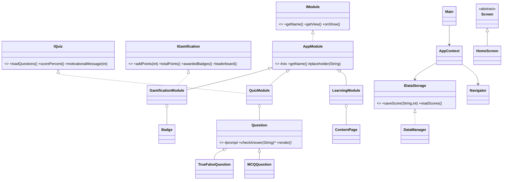

# EduSDG Class Diagram (Mermaid)

SUGGESTION (AI-generated). Renders on GitHub and in many Markdown viewers.

```mermaid
classDiagram
    class IModule { <<interface>> +getName() +getView() +onShow() }
    class IQuiz { <<interface>> +loadQuestions() +scorePercent() +motivationalMessage(int) }
    class IGamification { <<interface>> +addPoints(int) +totalPoints() +awardedBadges() +leaderboard() }
    class IDataStorage { <<interface>> +saveScore(String,int) +readScores() }
    class AppModule { <<abstract>> #ctx +getName() #placeholder(String) }
    class Question { <<abstract>> #prompt +checkAnswer(String)* +render()* }
    class Screen { <<abstract>> }

    IModule <|.. AppModule
    AppModule <|-- LearningModule
    AppModule <|-- QuizModule
    AppModule <|-- GamificationModule
    IQuiz <|.. QuizModule
    IGamification <|.. GamificationModule
    IDataStorage <|.. DataManager
    Question <|-- MCQQuestion
    Question <|-- TrueFalseQuestion
    Screen <|-- HomeScreen
    QuizModule o-- Question
    LearningModule o-- ContentPage
    GamificationModule o-- Badge
    AppContext --> Navigator
    AppContext --> IDataStorage
    Main --> AppContext
```
